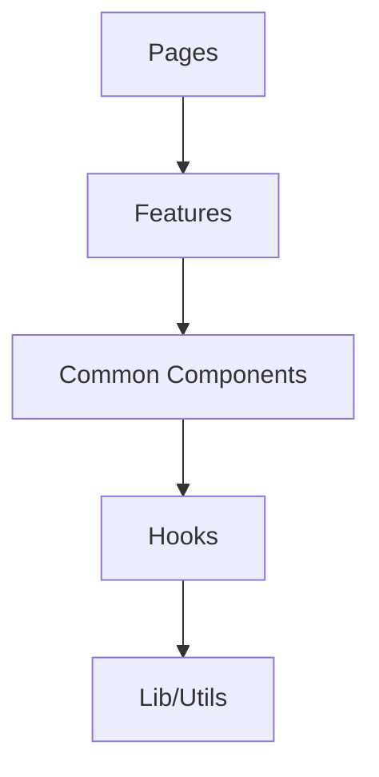

# アーキテクチャドキュメント更新

**使用方法**: `/docs:update_architecture [scope]`

## 更新対象スコープ
- **all**: 全ドキュメント更新 (デフォルト)
- **frontend**: フロントエンドのみ
- **backend**: バックエンドのみ  
- **infrastructure**: インフラ・設定のみ

## 更新内容

### 📁 ディレクトリ構造図
```
frontend/src/
├── components/           # UIコンポーネント
│   ├── common/          # 汎用コンポーネント
│   └── layout/          # レイアウト専用
├── features/            # 機能別コンポーネント
├── pages/               # ページコンポーネント
├── hooks/               # カスタムフック
├── lib/                 # ユーティリティ
└── routes/              # ルーティング設定
```

### 🔄 データフロー図
- **State Management**: React hooks → Context
- **API Communication**: fetch → Custom hooks
- **Form Handling**: React Hook Form + Zod

### 🎯 設計原則
- **Single Responsibility**: 単一責任原則
- **DRY**: 重複排除  
- **KISS**: シンプル設計
- **YAGNI**: 必要最小限実装

### 📊 依存関係マップ


### 🛠️ 技術スタック
- **Frontend**: React 19 + TypeScript + Vite
- **UI**: MUI v6 + Emotion  
- **State**: Context API + useReducer
- **Testing**: Jest + React Testing Library
- **Documentation**: Storybook + TypeDoc

## 生成ファイル

### Architecture Decision Records (ADR)
- `docs/adr/adr-NNN-{decision}.md`
- RFC 形式での設計判断記録

### システム設計書  
- `docs/architecture/system-overview.md`
- `docs/architecture/frontend-architecture.md`
- `docs/architecture/data-flow.md`

### API仕様書
- `docs/api/endpoints.md`
- OpenAPI準拠の仕様定義

## 自動更新項目

### コンポーネント一覧
- TSDoc からの自動抽出
- Props interface の型情報
- 使用例とサンプルコード

### Hook一覧
- カスタムフック詳細
- パラメータ・戻り値型  
- 使用パターン例

### 型定義一覧
- TypeScript interface
- ビジネスドメインモデル
- API レスポンス型