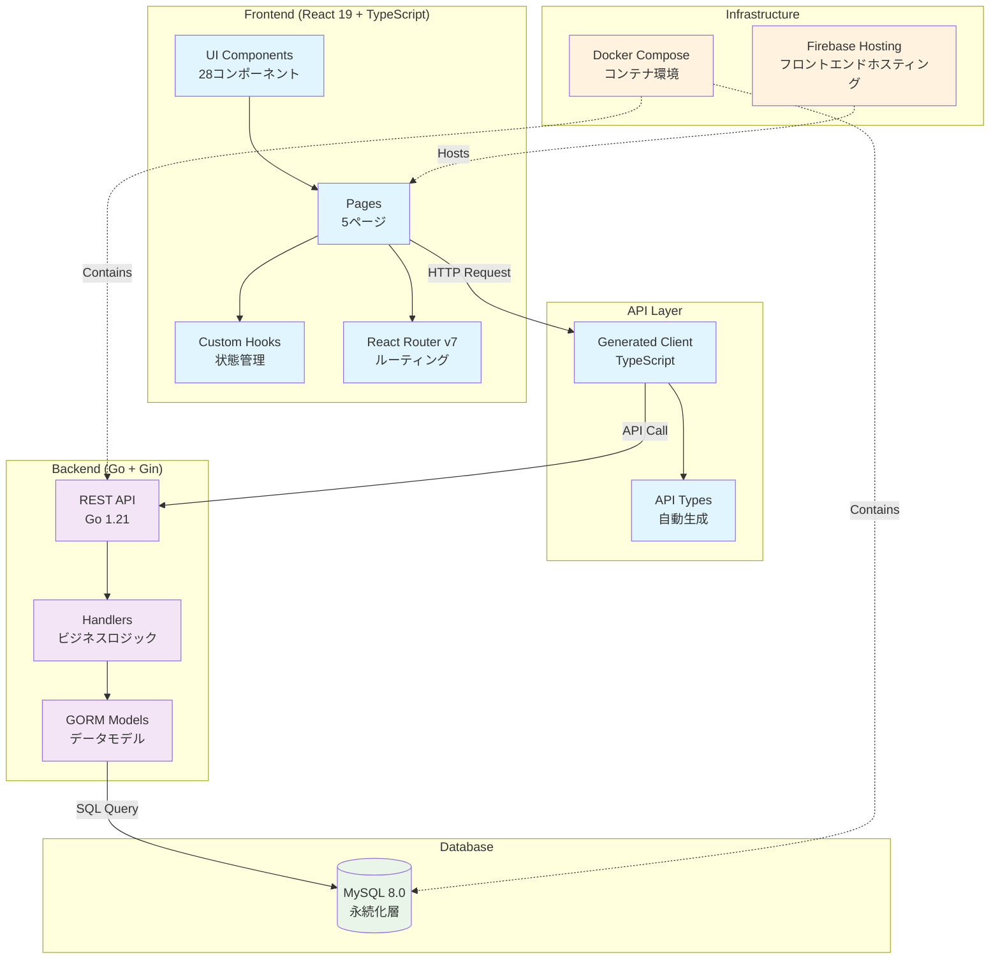
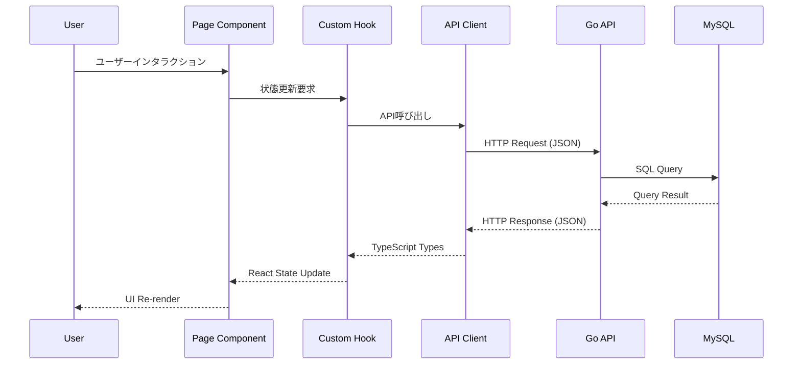

# アーキテクチャ概要（1枚絵 + 契約の掟）

**目的**: 正確性の源泉（依存関係・境界の誤解を防止）

**適用範囲**:
- 対象: システム全体構成・データフロー・API契約
- 影響: コンポーネント設計・API連携・状態管理

**更新方針**:
- 変更があったらアーキテクト・リードが更新
- 最低レビュー: 2名（設計観点必須）
- Freshness: 機能追加時・技術刷新時に必須更新

## 🏗 システム全体構成



## 🔄 データフロー詳細



## 📋 契約の掟（禁止事項・必須事項）

### 🚫 **禁止事項**

#### API アクセス
- **直接のfetch/axios禁止**: 必ず生成クライアント経由でAPI呼び出し
- **型定義の手動作成禁止**: OpenAPI仕様から自動生成された型のみ使用
- **ハードコードURL禁止**: 環境変数・設定ファイル経由でエンドポイント管理

#### コンポーネント設計
- **直接DOM操作禁止**: React的な宣言的UI更新のみ
- **グローバル状態の乱用禁止**: ローカル状態優先、必要時のみContext使用
- **forwardRef使用禁止**: React 19のref as propパターン使用

#### データ管理
- **直接SQL実行禁止**: 必ずGORMモデル経由
- **環境依存ハードコード禁止**: Docker Compose・環境変数で統一管理

### ✅ **必須事項**

#### 品質保証
- **5段階品質チェック必須**: Prettier→ESLint→TypeScript→Jest→Build
- **全テスト通過必須**: 240テスト、25スイート、0エラー
- **TSDoc記述必須**: @example付きでコンポーネント仕様明記

#### 開発フロー
- **バレルエクスポート必須**: 各ディレクトリにindex.ts配置
- **コンテナベース開発必須**: Makefileコマンド経由での統一実行
- **型安全性必須**: TypeScript strict mode、any型使用禁止

## 🎯 コンポーネント分離戦略

### Phase 2: Directory Structure Migration (85%完了)

```
frontend/src/components/
├── ui/           # 10コンポーネント - 基本UIパーツ
│   ├── AmountInput.tsx      # 金額入力（専用フック付き）
│   ├── Button.tsx           # MUI Button統合
│   └── ...
├── forms/        # 6コンポーネント - フォーム特化
│   ├── ControlledAmountInput.tsx    # react-hook-form連携
│   ├── TransactionForm.tsx          # 統合取引フォーム
│   └── ...
├── navigation/   # 10コンポーネント - ナビゲーション
│   ├── AppDrawer.tsx        # サイドドロワー
│   ├── AppNavigation.tsx    # 統合ナビゲーション
│   └── ...
└── layout/       # 2コンポーネント - レイアウト
    ├── AppLayout.tsx        # メインレイアウト
    └── ...
```

### 境界の責務

- **ui/**: 再利用可能な基本UIパーツ（ビジネスロジック無し）
- **forms/**: フォーム処理特化（バリデーション・状態管理）
- **navigation/**: ルーティング・メニュー処理
- **layout/**: ページ全体構造・共通レイアウト
- **pages/**: ページ固有ビジネスロジック・データ取得

## 🔧 技術スタック詳細

### フロントエンド技術選択理由

| 技術 | バージョン | 選択理由 | 制約・注意点 |
|------|-----------|----------|-------------|
| React | 19 | ref as prop対応、最新機能 | forwardRef非推奨 |
| TypeScript | 5.x | strict mode、型安全性 | any型禁止 |
| MUI | v6 | sx props、日本語対応 | slotProps活用 |
| React Router | v7 | useRoutes、コード分割 | 宣言的ルート定義 |
| Jest | 29.x | React Testing Library統合 | act()警告対応済み |

### バックエンド技術選択理由

| 技術 | バージョン | 選択理由 | 制約・注意点 |
|------|-----------|----------|-------------|
| Go | 1.21 | 型安全・パフォーマンス | goroutine活用 |
| Gin | 1.9.x | 軽量・高速 | ミドルウェア統一 |
| GORM | 2.0.x | ORM・マイグレーション | Auto Migrate使用 |
| MySQL | 8.0 | JSON型・パフォーマンス | 文字コードutf8mb4 |

## 🚀 スケーラビリティ設計

### 水平スケール対応
- **ステートレス設計**: セッション情報外部化
- **DB接続プール**: GORM設定最適化
- **キャッシュ戦略**: Redis導入準備

### 縦方向拡張
- **コード分割**: React.lazy + Suspense
- **バンドル最適化**: Vite設定・Tree shaking
- **メモリ最適化**: React.memo + useMemo適用

### 運用スケール
- **CI/CD自動化**: GitHub Actions + Firebase Hosting
- **監視・ログ**: 将来的なObservability導入準備
- **エラーハンドリング**: 統一エラー処理・ユーザー体験重視

## 🔍 アーキテクチャ検証

### 設計原則チェックリスト
- [ ] 単一責任の原則（各コンポーネント・モジュール）
- [ ] 依存性逆転（インターフェース優先設計）
- [ ] 開放閉鎖の原則（拡張容易、修正最小）
- [ ] 関心の分離（UI・ロジック・データアクセス）

### パフォーマンス検証
- [ ] バンドルサイズ監視
- [ ] レンダリング最適化
- [ ] API応答時間
- [ ] データベースクエリ効率

### セキュリティ検証
- [ ] 入力値バリデーション（Zod）
- [ ] SQL インジェクション対策（GORM）
- [ ] XSS対策（React標準エスケープ）
- [ ] CORS設定適切化