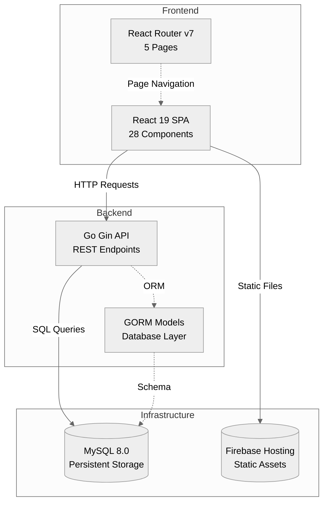
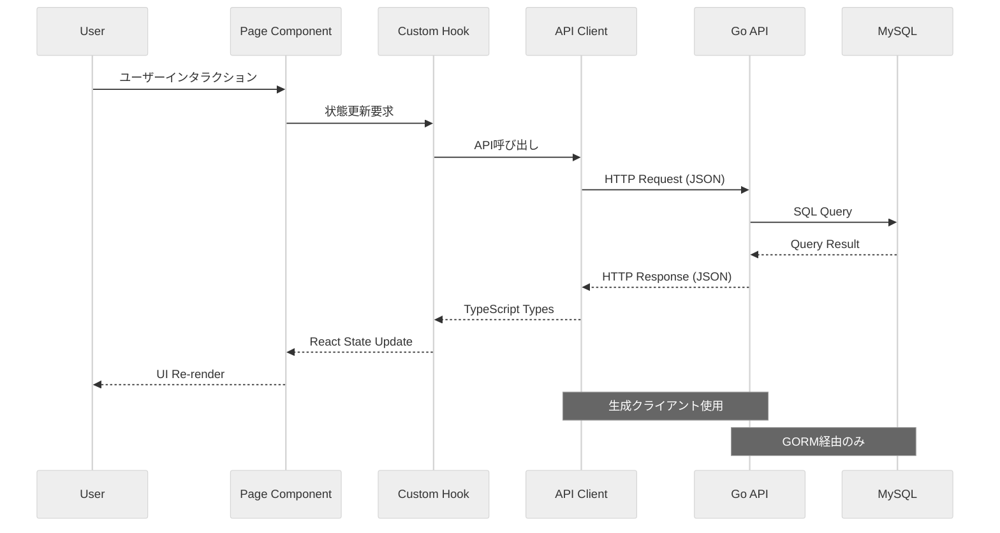
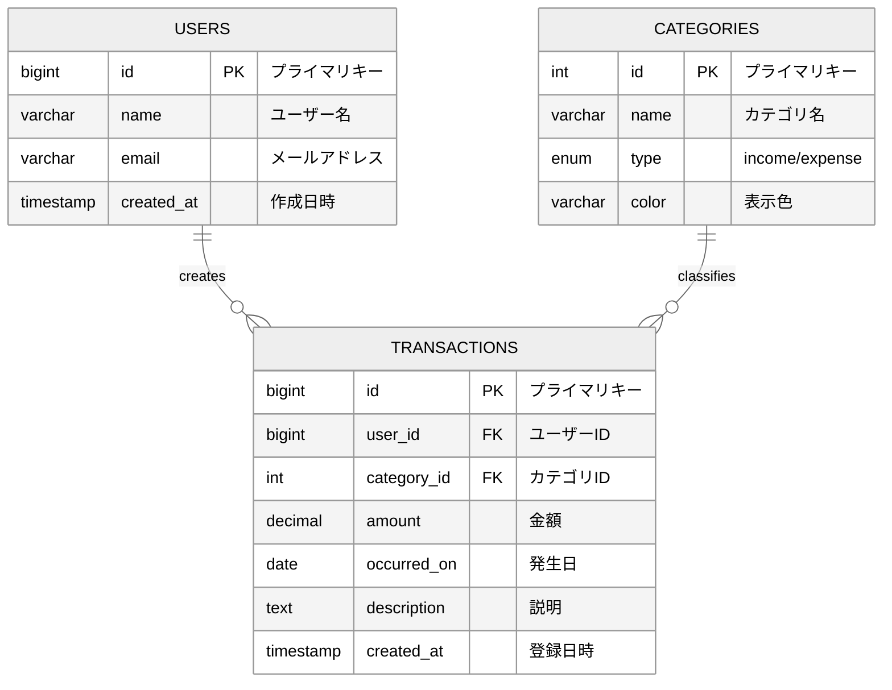
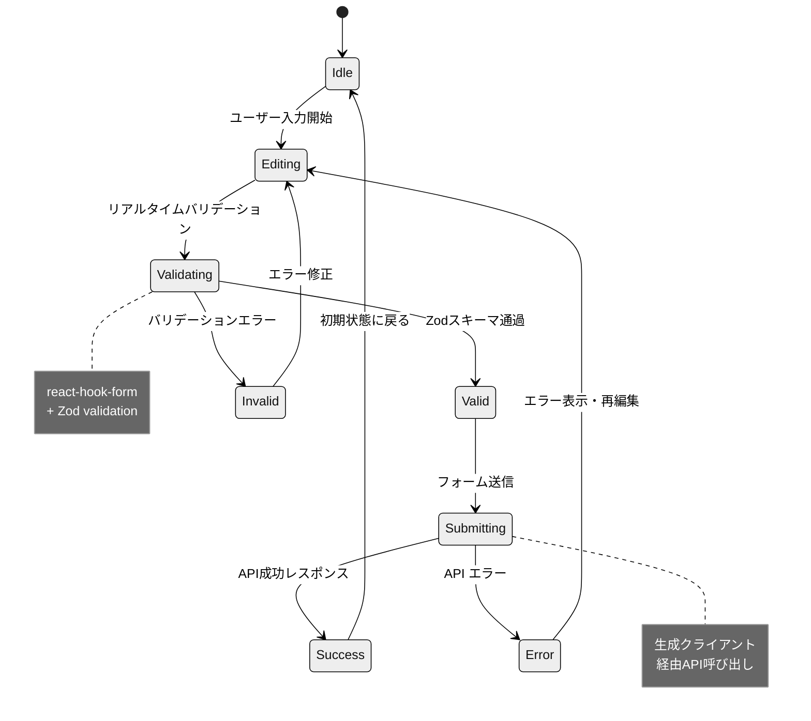
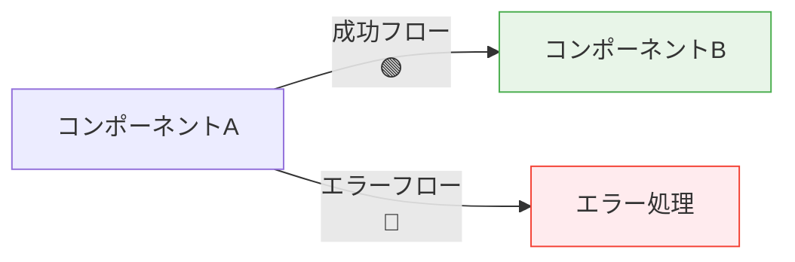
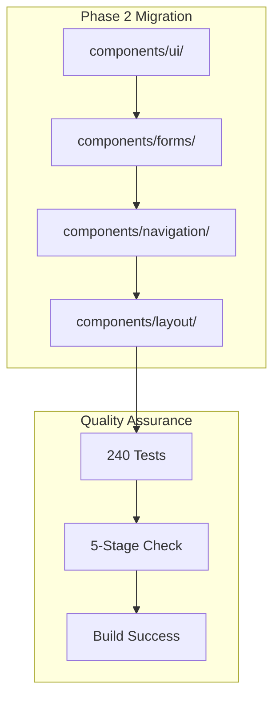

# Mermaid図解ガイド

**目的**: 視覚的理解促進・設計コミュニケーション向上

**適用範囲**:
- 対象: アーキテクチャ・フロー・データモデル・状態図
- 影響: 設計理解・レビュー効率・ドキュメント保守性

**更新方針**:
- 変更があったらアーキテクト・設計者が更新
- **1ファイル1図の原則**: 差分レビュー容易性重視
- **Markdown直書き**: `.mmd`ファイル不使用、保守最小化

## 🎯 図解標準化方針

### 優先順位
1. **Mermaid（標準）**: フローチャート・シーケンス・ER・状態図
2. **PlantUML（補助）**: 厳密UML表現が必要時のみ
3. **Graphviz（最小）**: 単純グラフ構造のみ

### VSCode環境セットアップ
```bash
# 推奨拡張機能
- Markdown Preview Mermaid Support
- Markdown All in One
- (必要時) PlantUML
- (必要時) Graphviz (dot) language support
```

## 📊 図解種別・用途

### 1. システムアーキテクチャ図


### 2. データフロー・API呼び出し


### 3. データモデル・ER図


### 4. コンポーネント状態図


## 🎨 図解スタイルガイド

### 統一テーマ設定
```mermaid
%%{init: {'theme':'neutral','themeVariables':{'primaryColor':'#1976d2','primaryTextColor':'#fff','primaryBorderColor':'#1565c0','lineColor':'#757575','sectionBkgColor':'#f5f5f5','altSectionBkgColor':'#ffffff','gridColor':'#e0e0e0','textColor':'#212121','fontSize':'14px'}}}%%
```

### 色彩ガイドライン
- **Primary**: `#1976d2` (メイン要素)
- **Secondary**: `#dc004e` (重要な注意点)
- **Success**: `#4caf50` (正常フロー)
- **Error**: `#f44336` (エラー・警告)
- **Neutral**: `#757575` (補助要素)

### アクセシビリティ対応


## 🔧 図解作成・保守手順

### 新規図解作成
1. **目的明確化**: 何を伝えたいか・誰が読むか
2. **種類選択**: フロー・シーケンス・ER・状態から選択
3. **Markdown直書き**: ファイル内にMermaidコードブロック記述
4. **VSCode確認**: プレビューで表示確認
5. **レビュー**: 設計観点・理解容易性確認

### 図解更新・保守
```bash
# VSCodeでのプレビュー確認
Ctrl+Shift+V (Windows/Linux)
Cmd+Shift+V (Mac)

# 必要時のSVG出力 (CI/CDで自動化可能)
npx @mermaid-js/mermaid-cli -i diagram.md -o diagram.svg
```

### バージョン管理
- **Git差分**: テキストベースで変更内容明確
- **コミット**: 図解変更理由をコミットメッセージに明記
- **レビュー**: PRで図解変更の意図・正確性確認

## 📋 図解作成チェックリスト

### 品質基準
- [ ] **1図1概念**: 複雑すぎず、焦点が明確
- [ ] **ラベル明示**: 矢印・関係性の意味が明確
- [ ] **色彩配慮**: カラーブラインドネス対応・コントラスト確保
- [ ] **レイアウト**: 読み順・視線の流れが自然

### 技術基準  
- [ ] **Mermaidシンタックス**: 構文エラーなし
- [ ] **VSCodeプレビュー**: 正常表示確認
- [ ] **GitHub表示**: ブラウザでの表示確認
- [ ] **レスポンシブ**: モバイル表示でも読みやすい

## 🚀 高度な図解テクニック

### サブグラフ活用


### ノート・コメント活用
```mermaid
graph LR
    A[API Request] --> B{Authentication}
    B -->|Valid| C[Process Request]
    B -->|Invalid| D[401 Error]
    
    Note right of B : JWT Token<br/>Validation
    Note right of C : Business Logic<br/>Processing
```

## 🔗 参考リソース

### Mermaid公式
- [Mermaid Live Editor](https://mermaid.live/) - ブラウザでリアルタイム編集
- [Mermaid Documentation](https://mermaid.js.org/) - 公式ドキュメント
- [Mermaid Cheat Sheet](https://jojozhuang.github.io/tutorial/mermaid-cheat-sheet/) - 記法一覧

### VSCode拡張
- [Markdown Preview Mermaid Support](https://marketplace.visualstudio.com/items?itemName=bierner.markdown-mermaid)
- [Mermaid Markdown Syntax Highlighting](https://marketplace.visualstudio.com/items?itemName=bpruitt-goddard.mermaid-markdown-syntax-highlighting)