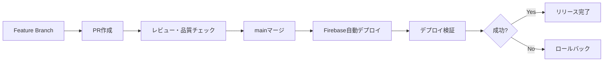

# 変更管理・リリース運用

**目的**: 破壊的変更の可視化と合意形成・安全なリリースフロー確立

**適用範囲**:
- 対象: バージョニング・リリース判定・変更管理・ロールバック
- 影響: プロダクト品質・チーム協調・ユーザー影響最小化

**更新方針**:
- 変更があったらリリースマネージャー・テックリードが更新
- 最低レビュー: 2名（リスク評価必須）
- Freshness: 四半期毎にリリースプロセス見直し

## 📋 バージョニング規約（SemVer準拠）

### バージョン番号の定義
```
MAJOR.MINOR.PATCH (例: v0.4.1)
```

- **MAJOR (0)**: 破壊的変更・非互換API変更
- **MINOR (4)**: 新機能追加・後方互換性維持
- **PATCH (1)**: バグフィックス・軽微な改善

### 現在のバージョン状況
- **Current**: v0.4.1
- **Phase**: Phase 2 Directory Structure Migration (85%完了)
- **Next**: v0.5.0 (Phase 2完了・新機能追加予定)

## 🚀 リリース判定基準

### Phase 2完了判定 (v0.5.0リリース条件)
- [ ] **ディレクトリ移行完了**: 旧`*_old`ディレクトリ削除
- [ ] **テスト通過**: 240テスト、25スイート全通過維持
- [ ] **品質チェック**: 5段階品質チェック完全通過
- [ ] **ドキュメント更新**: 二層ドキュメント化対応完了
- [ ] **CI/CD正常**: Firebase Hostingデプロイ成功

### リリース前必須チェックリスト
```bash
# 1. コード品質チェック
make quality-check-frontend     # 5段階チェック通過

# 2. 全テスト実行
make test-frontend              # 240テスト全通過

# 3. プロダクションビルド確認
npm run build                   # エラーなしでビルド完了

# 4. 依存関係脆弱性チェック
npm audit --audit-level high    # 高危険度脆弱性なし

# 5. バンドルサイズ確認
make analyze-bundle             # サイズ増加確認・最適化
```

## 🔄 破壊的変更管理手順

### 破壊的変更の定義
1. **API仕様変更**: レスポンス形式・エンドポイント変更
2. **コンポーネントProps変更**: 必須プロパティ追加・型変更
3. **ビルド・実行環境変更**: Node.js・Go・Docker要件変更
4. **データベーススキーマ変更**: テーブル構造・制約変更

### 破壊的変更実装フロー
```
Dry-run → Plan → Apply → Verify → Revert(if needed)
```

#### 1. Dry-run（影響範囲確認）
```bash
# 影響範囲分析
make analyze-impact CHANGE=component-api-change
# → 依存関係・使用箇所の特定
# → 移行工数・リスクの見積もり
```

#### 2. Plan（実装計画策定）
- **ADR作成**: `docs-src/adr/XXXX-breaking-change-plan.md`
- **マイグレーションガイド**: 既存コードの更新手順
- **ロールバック計画**: 問題発生時の戻し手順

#### 3. Apply（段階的適用）
```bash
# フィーチャーブランチで実装
git checkout -b breaking-change/component-api-v2

# 段階的適用
# Step1: 新旧API両対応（非互換フラグ付き）
# Step2: 移行期間設定・警告表示
# Step3: 旧API削除・新API完全移行
```

#### 4. Verify（検証）
```bash
# 全面的テスト実行
make test-frontend              # ユニットテスト
make test-e2e                  # E2Eテスト（将来実装）
make test-performance          # パフォーマンステスト（将来実装）
```

#### 5. Revert（必要時ロールバック）
```bash
# 緊急時ロールバック手順
git revert <commit-hash>        # コード戻し
make deploy-rollback           # 前バージョンデプロイ
make db-rollback               # DB状態復元
```

## 📊 リリースノート生成

### 自動生成テンプレート
```markdown
# Release v0.5.0 - Phase 2 Complete

## 🎯 Major Changes
- ✅ Directory Structure Migration完了
- ✅ 二層ドキュメント化方針採用
- ✅ 28コンポーネント機能別分離

## 🚀 New Features
- [ ] 新機能A: 機能説明
- [ ] 新機能B: 機能説明

## 🐛 Bug Fixes
- [ ] バグ修正A: 修正内容
- [ ] バグ修正B: 修正内容

## 🔧 Technical Improvements
- ✅ Firebase Hosting CI/CD修正
- ✅ テスト最適化・パフォーマンス向上
- ✅ コンポーネントドキュメント充実

## 📋 Migration Guide
破壊的変更がある場合の移行手順

## 🔗 Related
- PRs: #XX, #XX
- Issues: #XX, #XX
```

### リリースノート生成コマンド
```bash
# 自動リリースノート生成（将来実装）
make release-notes FROM=v0.4.1 TO=v0.5.0
# → コミット履歴・PR・Issue から自動生成
# → 破壊的変更・新機能・バグ修正を分類
```

## 🎯 デプロイメント戦略

### 段階的デプロイ
1. **Development**: 機能ブランチでの開発・テスト
2. **Staging**: PR作成→レビュー・品質チェック
3. **Production**: mainブランチマージ→自動デプロイ

### デプロイメントパイプライン


### デプロイ前チェック
```bash
# プレデプロイチェック
make pre-deploy-check
# → 全品質チェック実行
# → 環境変数・設定確認
# → 依存関係・セキュリティ確認
```

## 🔧 リリース自動化（将来実装）

### GitHub Actions活用
```yaml
# .github/workflows/release.yml
name: Release Management
on:
  push:
    tags: ['v*']
    
jobs:
  release:
    runs-on: ubuntu-latest
    steps:
      - uses: actions/checkout@v4
      - name: Quality Check
        run: make quality-check-frontend
      - name: Generate Release Notes
        run: make release-notes
      - name: Create GitHub Release
        uses: actions/create-release@v1
```

### セマンティックリリース
```json
// package.json
{
  "scripts": {
    "release": "semantic-release",
    "release:dry": "semantic-release --dry-run"
  }
}
```

## 📋 ADRテンプレート

### 破壊的変更ADR
```markdown
# ADR-XXXX: [変更タイトル]

## Status
Proposed / Accepted / Deprecated

## Context
変更が必要な背景・問題設定

## Decision
実施する変更内容・選択した解決策

## Alternatives
検討した代替案・選択しなかった理由

## Consequences
### Positive
- 期待される効果・メリット

### Negative  
- 発生するリスク・デメリット

### Neutral
- 影響が中立的な変更点

## Implementation Plan
実装手順・スケジュール・責任者

## Monitoring & Metrics
成功指標・監視方法・計測項目

## Rollback Plan
問題発生時のロールバック手順

## Review Schedule
再評価実施日・見直し条件
```

## 🚀 継続的改善

### リリースプロセス改善
- **四半期レビュー**: プロセス効率・品質向上点の洗い出し
- **メトリクス収集**: リードタイム・エラー率・満足度
- **自動化推進**: 手動作業削減・人的ミス防止

### 品質向上取り組み
- **テスト自動化拡大**: E2E・契約・パフォーマンステスト
- **監視・アラート**: 本番環境での問題早期検出
- **フィードバック活用**: ユーザー・開発チームからの改善提案