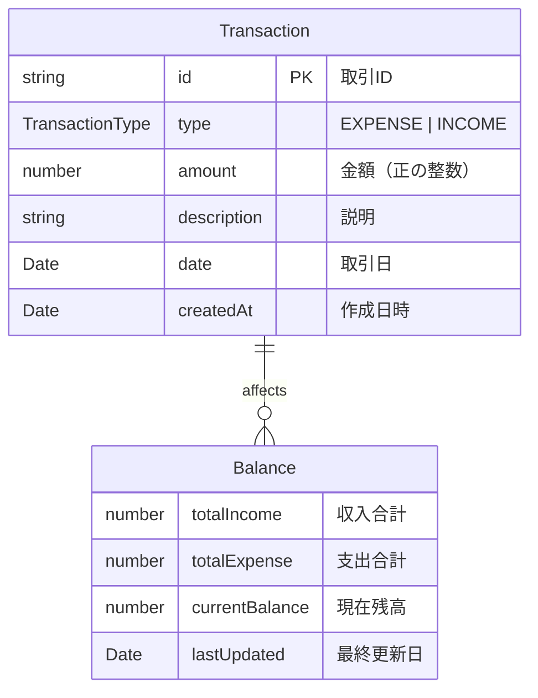

# 家計簿アプリ 用語集・ドメインモデル

## 📚 ドメイン用語定義

### 金額・取引関連

| 用語 | 英語 | 定義 | 境界・制約 |
|---|---|---|---|
| **金額** | Amount | 数値で表現される金銭的価値 | 0以上、MAX_SAFE_INTEGER未満の整数 |
| **支出** | Expense | 家計から出て行く金額 | 正の数値のみ、カテゴリ必須 |
| **収入** | Income | 家計に入ってくる金額 | 正の数値のみ、源泉記録推奨 |
| **残高** | Balance | 収入合計 - 支出合計 | 負値も許可（赤字状態） |
| **取引** | Transaction | 支出・収入の記録単位 | 日付・金額・説明を含む |

### UI・表示関連

| 用語 | 英語 | 定義 | 境界・制約 |
|---|---|---|---|
| **フォーマット** | Format | 金額の表示形式 | ¥記号、カンマ区切り、右寄せ |
| **入力UI** | Input UI | ユーザーが値を入力するコンポーネント | ゼロ・負値は空文字表示 |
| **表示UI** | Display UI | 値を表示するコンポーネント | 全値表示（ゼロ・負値含む） |
| **履歴** | History | 過去の取引記録一覧 | 日付グループ化、新しい順 |

## 🏗️ データモデル

## 💰 金額フォーマット規約

### 基本仕様
- **通貨記号**: ¥（日本円固定）
- **区切り文字**: カンマ（3桁区切り）
- **小数点**: 通常0桁、詳細計算時2桁
- **負数表現**: ¥-1,500（マイナス記号付き）
- **ゼロ表示**: ¥0（入力UIでは空文字）

### 精度制約
- **最大値**: Number.MAX_SAFE_INTEGER (9,007,199,254,740,991)
- **最小値**: Number.MIN_SAFE_INTEGER (-9,007,199,254,740,991)  
- **理由**: JavaScript数値精度保証の範囲内で動作

### 用途別フォーマット

| 用途 | 関数 | ゼロ値 | 負値 | 用例 |
|---|---|---|---|---|
| **入力UI** | `formatMoneyForInput` | 空文字 | 空文字 | AmountInput |
| **表示UI** | `formatMoneyForDisplay` | ¥0 | ¥-1,500 | AmountText |
| **カスタム** | `formatMoney` | オプション | オプション | 任意 |

### 丸め処理
- **四捨五入**: Math.round() 使用
- **小数点以下**: toFixed() で桁数制御
- **境界値**: MAX_SAFE_INTEGERで事前チェック

## 🔍 バリデーション規則

### 金額入力
- **必須**: 正の数値のみ
- **形式**: 整数または小数（最大2桁）
- **範囲**: 1円 〜 MAX_SAFE_INTEGER円
- **禁止**: 負値、0、非数値、無限大

### 説明・メモ
- **文字数**: 1〜100文字
- **文字種**: 全角・半角・記号・改行可
- **必須**: 支出は任意、収入は推奨

### 日付
- **範囲**: 1900年1月1日 〜 2100年12月31日
- **初期値**: 今日の日付
- **形式**: YYYY-MM-DD（ISO 8601）

## 🎨 UI設計原則

### レイアウト
- **金額**: 右寄せ（桁数把握しやすさ）
- **プレースホルダー**: 中央揃え（入力誘導）
- **ラベル**: 左寄せ（読みやすさ）

### 色・状態
- **収入**: 緑系（success.main）
- **支出**: 赤系（error.main）  
- **残高**: プラスは青系、マイナスは赤系
- **エラー**: 標準エラー色（error.main）

### アクセシビリティ
- **キーボード操作**: Tab順序、Enter送信
- **スクリーンリーダー**: aria-label適切設定
- **コントラスト比**: WCAG AA準拠（4.5:1以上）

## 📱 パフォーマンス予算

### Bundle Size
- **全体**: < 500KB (gzipped)
- **コンポーネント**: < 10KB each
- **ライブラリ**: 必要最小限のみインポート

### Runtime
- **初期表示**: < 2秒 (TTI)
- **金額計算**: < 100ms
- **フォーマット**: < 50ms
- **再レンダリング**: 必要時のみ

## 🌐 国際化（将来拡張）

### 対応予定
- **言語**: 日本語（現在）→ 英語・中国語
- **通貨**: 日本円 → USD, EUR, CNY対応
- **日付**: 和暦・西暦両対応
- **数値**: 各国の区切り文字対応

### 技術的準備
- **文言**: i18next導入予定
- **通貨**: Intl.NumberFormat活用
- **日付**: Intl.DateTimeFormat活用
- **設定**: ユーザー言語設定保存

---

## 📖 関連ドキュメント

- [TypeDoc API仕様](./build/typedoc/) - 型定義とAPI詳細
- [Storybook](./build/storybook/) - コンポーネント操作ガイド  
- [テストレポート](./build/coverage/) - 品質保証状況
- [品質ガイド](./quality/) - a11y/i18n/性能方針

## 🔄 更新履歴

| 日付 | バージョン | 変更内容 |
|---|---|---|
| 2025-08-12 | v1.0.0 | 初版作成、TSDoc統一、精度制約追加 |

---

> 💡 **Note**: この用語集は開発チーム全体で共有される「共通言語」です。
> 新しい概念や制約が発生した場合は、必ずここに追加・更新してください。