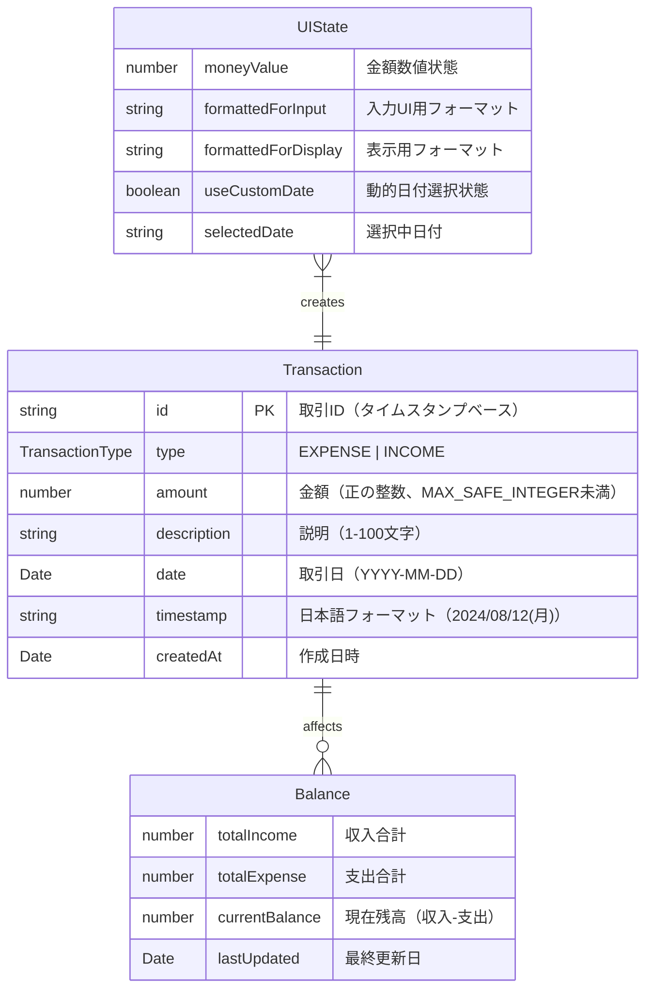

# 家計簿アプリ 用語集・ドメインモデル

## 📚 ドメイン用語定義

### 金額・取引関連

| 用語     | 英語        | 定義                       | 境界・制約                        |
| -------- | ----------- | -------------------------- | --------------------------------- |
| **金額** | Amount      | 数値で表現される金銭的価値 | 0以上、MAX_SAFE_INTEGER未満の整数 |
| **支出** | Expense     | 家計から出て行く金額       | 正の数値のみ、カテゴリ必須        |
| **収入** | Income      | 家計に入ってくる金額       | 正の数値のみ、源泉記録推奨        |
| **残高** | Balance     | 収入合計 - 支出合計        | 負値も許可（赤字状態）            |
| **取引** | Transaction | 支出・収入の記録単位       | 日付・金額・説明を含む            |

### UI・表示関連

| 用語                   | 英語               | 定義                                 | 境界・制約                      |
| ---------------------- | ------------------ | ------------------------------------ | ------------------------------- |
| **フォーマット**       | Format             | 金額の表示形式                       | ¥記号、カンマ区切り、右寄せ     |
| **入力UI**             | Input UI           | ユーザーが値を入力するコンポーネント | ゼロ・負値は空文字表示          |
| **表示UI**             | Display UI         | 値を表示するコンポーネント           | 全値表示（ゼロ・負値含む）      |
| **履歴**               | History            | 過去の取引記録一覧                   | 日付グループ化、新しい順        |
| **ラベル**             | Label              | テキスト項目の識別表示               | 自動コロン付加、統一表記        |
| **トレーサビリティ表** | Traceability Table | 仕様と実装の関連性を示す表           | ADR・テスト・品質ガイドとの連携 |

### コンポーネント・アーキテクチャ関連

| 用語             | 英語                        | 定義                               | 境界・制約                               |
| ---------------- | --------------------------- | ---------------------------------- | ---------------------------------------- |
| **統合フォーム** | Integrated Form             | 複数入力要素を組み合わせたフォーム | 金額・日付・送信の一体型UI               |
| **動的日付選択** | Dynamic Date Selection      | トグルで日付指定を切り替える機能   | デフォルト今日・カスタム日付の選択       |
| **状態管理分離** | State Management Separation | 状態管理とフォーマット処理の分離   | useMoney（状態）+ useMoneyFormat（表示） |
| **ローカライズ** | Localization                | 日本語・日本円対応の地域化         | 日本語曜日表示、¥記号、YYYY年MM月DD日    |

### テスト・品質関連

| 用語               | 英語              | 定義                             | 境界・制約                       |
| ------------------ | ----------------- | -------------------------------- | -------------------------------- |
| **テスト最適化**   | Test Optimization | テストパフォーマンス向上設定     | Jest timeout延長、CPU効率化      |
| **act()警告**      | Act Warning       | React状態更新テストでの警告      | ユーザーインタラクションをラップ |
| **Ripple無効化**   | Ripple Disabling  | MUIボタンアニメーション無効化    | テスト実行時間短縮               |
| **動的インポート** | Dynamic Import    | ES2020の非同期モジュール読み込み | require()より型安全              |

## 🏗️ データモデル

## 💰 金額フォーマット規約

### 基本仕様

- **通貨記号**: ¥（日本円固定）
- **区切り文字**: カンマ（3桁区切り）
- **小数点**: 通常0桁、詳細計算時2桁
- **負数表現**: ¥-1,500（マイナス記号付き）
- **ゼロ表示**: ¥0（入力UIでは空文字）

### 精度制約

- **最大値**: Number.MAX_SAFE_INTEGER (9,007,199,254,740,991)
- **最小値**: Number.MIN_SAFE_INTEGER (-9,007,199,254,740,991)
- **理由**: JavaScript数値精度保証の範囲内で動作

### 用途別フォーマット

| 用途         | 関数                    | ゼロ値     | 負値       | 用例        |
| ------------ | ----------------------- | ---------- | ---------- | ----------- |
| **入力UI**   | `formatMoneyForInput`   | 空文字     | 空文字     | AmountInput |
| **表示UI**   | `formatMoneyForDisplay` | ¥0         | ¥-1,500    | AmountText  |
| **カスタム** | `formatMoney`           | オプション | オプション | 任意        |

### 丸め処理

- **四捨五入**: Math.round() 使用
- **小数点以下**: toFixed() で桁数制御
- **境界値**: MAX_SAFE_INTEGERで事前チェック

## 🔍 バリデーション規則

### 金額入力

- **必須**: 正の数値のみ
- **形式**: 整数または小数（最大2桁）
- **範囲**: 1円 〜 MAX_SAFE_INTEGER円
- **禁止**: 負値、0、非数値、無限大
- **精度チェック**: MAX_SAFE_INTEGER超過時は明確なエラーメッセージ
- **リアルタイム**: 入力中の即座バリデーション（TransactionForm）

### 説明・メモ

- **文字数**: 1〜100文字
- **文字種**: 全角・半角・記号・改行可
- **必須**: 支出は任意、収入は推奨

### 日付

- **範囲**: 1900年1月1日 〜 2100年12月31日
- **初期値**: 今日の日付（動的取得）
- **形式**: YYYY-MM-DD（ISO 8601 → 日本語表示変換）
- **動的選択**: トグルスイッチで今日/カスタム日付を切り替え
- **ローカライズ**: 日本語曜日付き表示（例: 2024/08/12(月)）

### フォーム状態

- **送信条件**: 正の数値 + 有効な日付のみ
- **リセット**: 金額のみクリア（日付・トグル状態は保持）
- **アクセシビリティ**: Enter送信・Tab順序・aria-label適切設定

## 🎨 UI設計原則

### レイアウト

- **金額**: 右寄せ（桁数把握しやすさ）
- **プレースホルダー**: 中央揃え（入力誘導）
- **ラベル**: 左寄せ（読みやすさ）

### 色・状態

- **収入**: 緑系（success.main）
- **支出**: 赤系（error.main）
- **残高**: プラスは青系、マイナスは赤系
- **エラー**: 標準エラー色（error.main）

### アクセシビリティ

- **キーボード操作**: Tab順序、Enter送信
- **スクリーンリーダー**: aria-label適切設定
- **コントラスト比**: WCAG AA準拠（4.5:1以上）

## 📱 パフォーマンス予算

### Bundle Size

- **全体**: < 500KB (gzipped)
- **コンポーネント**: < 10KB each
- **ライブラリ**: 必要最小限のみインポート

### Runtime

- **初期表示**: < 2秒 (TTI)
- **金額計算**: < 100ms
- **フォーマット**: < 50ms
- **再レンダリング**: 必要時のみ

## 🌐 国際化（将来拡張）

### 対応予定

- **言語**: 日本語（現在）→ 英語・中国語
- **通貨**: 日本円 → USD, EUR, CNY対応
- **日付**: 和暦・西暦両対応
- **数値**: 各国の区切り文字対応

### 技術的準備

- **文言**: i18next導入予定
- **通貨**: Intl.NumberFormat活用
- **日付**: Intl.DateTimeFormat活用
- **設定**: ユーザー言語設定保存

---

## 📖 関連ドキュメント

- [TypeDoc API仕様](./build/typedoc/) - 型定義とAPI詳細
- [Storybook](./build/storybook/) - コンポーネント操作ガイド
- [テストレポート](./build/coverage/) - 品質保証状況
- [品質ガイド](./quality/) - a11y/i18n/性能方針

## 🔄 用語集運用ルール

### 📝 更新タイミング（必須）

以下の場合は**必ず**用語集更新を検討・実施してください：

1. **新機能開発時**
   - 新しいドメイン概念（カテゴリ、予算、レポート等）
   - 新しいUI概念（ダッシュボード、ウィジェット等）
   - 新しい制約・ルール（バリデーション、権限等）

2. **既存機能修正時**
   - 用語の意味・境界変更
   - データモデルの変更
   - フォーマット・表示ルール変更

3. **アーキテクチャ変更時**
   - 新しい技術概念の導入
   - API仕様の変更
   - パフォーマンス制約の変更

### 🚀 更新手順

1. **PR作成時**: PRテンプレートの用語集チェックボックス確認
2. **レビュー時**: 既存用語との整合性をレビュアーが確認
3. **マージ前**: 用語の重複・矛盾がないかチーム確認

### ⚠️ 注意事項

- **用語の削除**: 既存コード・ドキュメントへの影響を必ず確認
- **意味変更**: ADRでの判断記録を推奨（重要な変更の場合）
- **英語併記**: 将来のi18n対応を考慮し、英語用語も記載

### 🔍 品質管理

- **月次**: 用語の重複・冗長性をチームでレビュー
- **四半期**: 他プロジェクトとの用語統一検討
- **年次**: ドメインエキスパート（PO等）との用語再確認

---

## 🔄 更新履歴

| 日付       | バージョン | 変更内容                                                        |
| ---------- | ---------- | --------------------------------------------------------------- |
| 2025-08-23 | v1.3.0     | テスト・品質関連用語追加、最適化設定・動的インポート対応        |
| 2025-08-12 | v1.2.0     | JSDoc一括更新反映、UI・アーキテクチャ用語追加、データモデル拡張 |
| 2025-08-12 | v1.1.0     | 運用ルール追加、PRテンプレート連携                              |
| 2025-08-12 | v1.0.0     | 初版作成、TSDoc統一、精度制約追加                               |

---

> 💡 **Note**: この用語集は開発チーム全体で共有される「共通言語」です。  
> **運用ルールに従って**、新しい概念や制約が発生した場合は必ずここに追加・更新してください。
>
> 🔗 **関連**: [PRテンプレート](../../.github/PULL_REQUEST_TEMPLATE.md) の用語集チェック項目と連動
