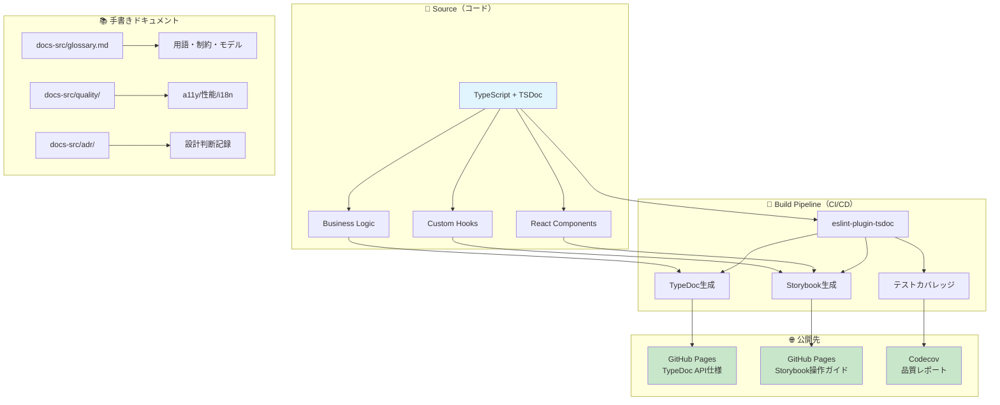

import { Meta } from '@storybook/addon-docs'

<Meta title="ドキュメント/プロジェクト概要" />

# 🏠 家計簿アプリ - ドキュメント統合ガイド

> **方針**: 「コードが真実 → 自動生成で各層へ拡張」  
> **目標**: 運用で詰まらない・スケールしても崩れないドキュメント体系

---

## 🚀 クイックスタート（新規参加者向け）

### 1. まず読むべき3つのドキュメント
1. **[用語集・ドメインモデル](./glossary.md)** - 家計簿ドメインの共通言語
2. **[品質ガイド](./quality/)** - a11y/性能/i18n方針  
3. **[ADR-0001](./adr/0001-use-tsdoc-unified-documentation.md)** - TSDoc統一の技術判断

### 2. 開発環境セットアップ
```bash
# 基本セットアップ
make npm-install
make test-frontend        # 127テスト実行
make lint-frontend        # ESLint + TSDoc チェック

# ドキュメント確認
make storybook-frontend   # http://localhost:6006
# TypeDoc（将来）: make docs-frontend
```

### 3. 開発フロー
```bash
# 新機能開発時
1. Issue確認 → ブランチ作成
2. TSDocコメント記述（必須）
3. Storybookストーリー作成
4. テスト記述
5. 用語集更新確認
6. PR作成（テンプレートチェック）
```

---

## 🏗️ ドキュメント体系 全体像



---

## 📊 TSDoc移行進捗（Phase 1-3）

### Phase 1: 基盤整備 ⚡ 
| 項目 | 状態 | 完了日 | 備考 |
|---|:---:|---|---|
| eslint-plugin-tsdoc導入 | ⏳ | - | 次の作業 |
| CI品質ゲート追加 | ⏳ | - | GitHub Actions |
| PRテンプレート更新 | ⏳ | - | 用語集チェック含む |
| TypeDoc TSDoc最適化 | ⏳ | - | プラグイン設定 |

### Phase 2: 既存コード移行 📝
| 対象 | ファイル数 | 完了数 | 進捗 | 責任者 |
|---|---:|---:|:---:|---|
| **lib/format** | 1 | 1 | ✅ 100% | [完了済み] |
| **hooks** | 4 | 0 | ⏳ 0% | - |
| **components/common** | 7 | 0 | ⏳ 0% | - |
| **features components** | 11 | 0 | ⏳ 0% | - |
| **合計** | **23** | **1** | **4%** | - |

### Phase 3: 運用定着 🎯
- [ ] チーム向けTSDoc研修実施
- [ ] 新規開発でのTSDoc遵守（100%）
- [ ] 月次品質レビュー制度運用
- [ ] パフォーマンス予算監視自動化

---

## 🔗 ドキュメント間のナビゲーション

### 📖 コンポーネント仕様を調べたい
```
1. Storybook で操作感確認
   ↓
2. TypeDoc で API詳細確認  
   ↓
3. 用語集でドメイン用語確認
```

### 🏗️ 設計方針を理解したい
```
1. ADR で技術判断を確認
   ↓  
2. 品質ガイドで制約確認
   ↓
3. 用語集でドメインモデル確認
```

### 🐛 バグ調査・品質改善したい
```
1. テストカバレッジで対象特定
   ↓
2. Storybook で再現確認
   ↓  
3. ADR で設計意図確認
```

---

## 🛠️ 開発者ツール・ショートカット

### よく使うコマンド
```bash
# 開発サーバー
make dev                  # フロントエンド開発サーバー
make storybook-frontend   # Storybook（ポート6006）

# 品質チェック
make quality-check        # lint + format + test 統合
make test-coverage-open   # ブラウザでカバレッジ表示

# ドキュメント生成（将来）
make docs-frontend        # TypeDoc生成
make docs-deploy          # GitHub Pages公開
```

### IDEでの効率的な開発
```typescript
// ✅ TSDocでIDE支援を最大活用
/**
 * 金額計算処理
 * @param amount - 入力金額
 * @returns 計算結果
 * @example
 * ```ts
 * const result = calculateBalance(15000);
 * ```
 */
// ← ホバーで詳細情報表示、引数補完、例示コード表示
```

---

## 📋 PR作成時のチェックリスト

### 必須確認項目
- [ ] **TSDoc記述**: 新規・修正した関数・コンポーネントにTSDoc追加
- [ ] **用語集更新**: 新しいドメイン概念がある場合は glossary.md 更新
- [ ] **Storybookストーリー**: UIコンポーネント変更時はストーリー更新
- [ ] **テスト追加**: 新機能・バグ修正のテストケース追加
- [ ] **品質チェック通過**: `make quality-check` で全チェック通過

### ドキュメント特化項目
- [ ] **ADR検討**: 重要な技術判断がある場合はADR作成検討
- [ ] **性能影響**: Bundle size, Core Web Vitals への影響確認
- [ ] **a11y確認**: アクセシビリティガイドライン遵守確認
- [ ] **型安全性**: Props型定義エクスポートと @defaultValue 記述

### レビュアー向け
- [ ] **TSDoc品質**: @example の動作確認、@remarks の妥当性
- [ ] **用語統一**: glossary.md の用語と一致しているか
- [ ] **設計一貫性**: 既存ADRの方針と矛盾していないか

---

## 🎯 品質目標・KPI

### 定量目標（月次測定）
- **TSDoc準拠率**: 100% (全公開API)
- **Lighthouse Accessibility**: 95点以上
- **Bundle Size**: < 300KB (gzipped)
- **テストカバレッジ**: > 90%
- **Core Web Vitals**: LCP < 2.5s, FID < 100ms, CLS < 0.1

### 運用目標（チーム）
- **PR品質**: TSDocチェックリスト漏れ 0件
- **ドキュメント同期**: コード変更時のドキュメント更新漏れ 0件
- **新規参加者**: オンボーディング1日で開発着手可能
- **技術判断**: 重要な判断は全てADR記録済み

---

## 🔧 トラブルシューティング

### よくある問題
```bash
# TSDoc lintエラーが出る
npm run lint:tsdoc        # 詳細エラー表示
# → @example や @remarks の記法を確認

# Storybookでコンポーネントが表示されない  
make storybook-frontend   # 再起動
# → react-docgen-typescript の型抽出エラー確認

# TypeDoc生成が失敗する
npx typedoc --version     # バージョン確認
# → TSDocタグの記法ミス、export漏れを確認
```

### サポート・質問
- **TSDoc記法**: [公式ドキュメント](https://tsdoc.org/) 
- **Storybook**: [MUI統合例](https://mui.com/material-ui/integrations/storybook/)
- **アクセシビリティ**: [品質ガイド](./quality/accessibility.md)
- **パフォーマンス**: [品質ガイド](./quality/performance.md)

---

## 📅 定期レビュー・改善サイクル

### 週次（チーム）
- TSDoc移行進捗確認
- PR品質チェックリスト遵守状況
- Bundle size・パフォーマンス確認

### 月次（プロジェクト）  
- 品質目標達成度測定
- 用語集・ADRの整理・重複排除
- 新規ツール・改善提案検討

### 四半期（戦略）
- ドキュメント戦略見直し
- 技術的負債返済計画
- 次期機能のドキュメント要件定義

---

## 🌟 将来展望

### 短期（3ヶ月）
- TSDoc移行完了（Phase 2-3）
- CI/CDでの品質ゲート自動化
- Storybook/TypeDoc自動公開

### 中期（6ヶ月）
- 多言語ドキュメント対応（i18n）
- コンポーネントライブラリ化
- パフォーマンス監視自動化

### 長期（1年）
- デザインシステム統合
- 他プロジェクトへの横展開
- AI支援ドキュメント生成

---

## 📚 関連リンク

### 🏠 内部ドキュメント
- **[用語集・ドメインモデル](./glossary.md)** - 共通言語定義
- **[アクセシビリティガイド](./quality/accessibility.md)** - WCAG 2.1 AA準拠
- **[パフォーマンスガイド](./quality/performance.md)** - 予算・監視・改善
- **[ADR一覧](./adr/)** - 技術判断記録

### 🌐 外部リソース
- **[Storybook（開発）](http://localhost:6006)** - コンポーネント操作
- **[アプリ（開発）](http://localhost:5173)** - 実環境確認  
- **[GitHub Repository](https://github.com/teruyoshi/family-budget-app)** - ソースコード

### 📖 技術仕様
- **[TSDoc公式](https://tsdoc.org/)** - コメント記法標準
- **[MUI v6](https://mui.com/material-ui/)** - UIライブラリ
- **[React Testing Library](https://testing-library.com/docs/react-testing-library/intro/)** - テスト

---

**最終更新**: 2025-08-12 | **次回レビュー**: 2025-09-12  
**管理者**: フロントエンドチーム | **文書バージョン**: v1.0.0

> 💡 **このドキュメントについて**: 
> プロジェクト全体の「共通理解」と「効率的な開発」を目的としています。
> 疑問・改善提案があれば、いつでもチームに共有してください！